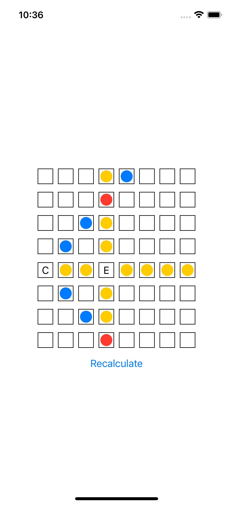
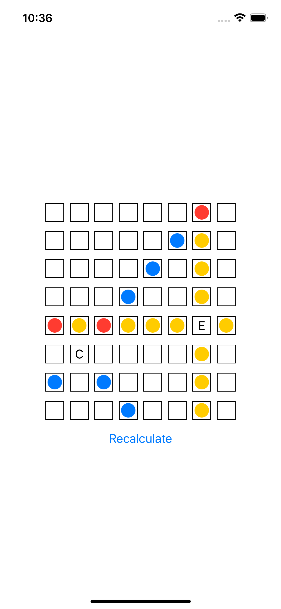
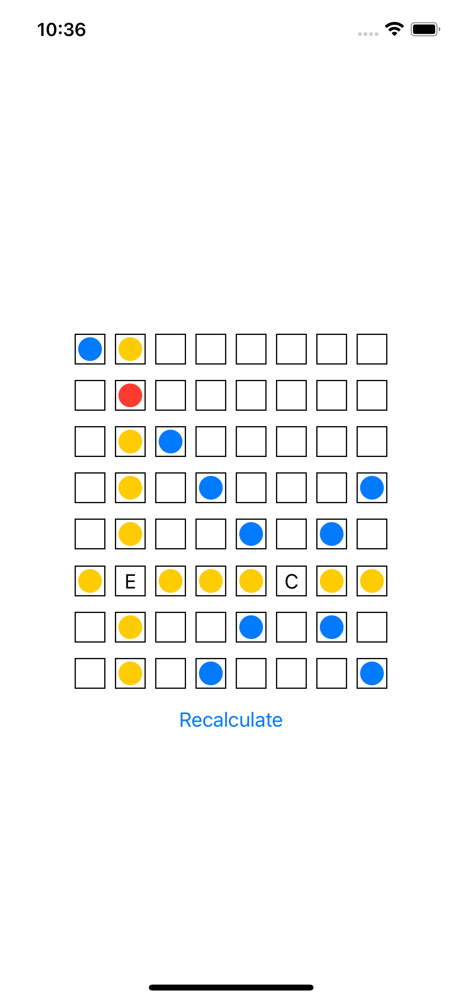

# 🧩 ColorChessBoard

A simple SwiftUI project that displays an 8x8 color-based grid (similar to a chessboard), where different colors and symbols represent different pieces or states like elephants, camels, and more. The board can be recalculated dynamically using a button.

---

## 📷 Preview

### 🖼 Screenshots





---

## 🛠 Features

- 8x8 grid display using SwiftUI `ForEach` loops.
- Uses `enum ColorCode` to define and manage color-coded states:
  - 🟡 `.yellow`
  - 🔴 `.red`
  - 🔵 `.blue`
  - ⚫️ `.black` → Represents an Elephant (`E`)
  - 🟢 `.green` → Represents a Camel (`C`)
  - ⚪️ `.undefine` → Empty/default cell
- Tap a button to **recalculate** the board state (e.g., mark rows/columns yellow).
- Clean separation of logic in `ChessViewModel` and `BoardModel`.

---


## 📦 Structure
```bash
.
├── Demo-1
│   ├── AppDelegate.swift
│   ├── Assets.xcassets
│   │   ├── AccentColor.colorset
│   │   │   └── Contents.json
│   │   ├── AppIcon.appiconset
│   │   │   └── Contents.json
│   │   └── Contents.json
│   ├── Base.lproj
│   │   ├── LaunchScreen.storyboard
│   │   └── Main.storyboard
│   ├── Coordinator
│   │   └── MainCoordinator.swift
│   ├── Info.plist
│   ├── Model
│   │   └── ColorCode.swift
│   ├── SceneDelegate.swift
│   ├── Service
│   │   └── CalculationService.swift
│   ├── View
│   │   └── ChessView.swift
│   ├── ViewController.swift
│   └── ViewModel
│       └── ChessViewModel.swift
├── Demo-1.xcodeproj
│   ├── project.pbxproj
│   ├── project.xcworkspace
│   │   ├── contents.xcworkspacedata
│   │   ├── xcshareddata
│   │   │   └── swiftpm
│   │   │       └── configuration
│   │   └── xcuserdata
│   │       └── shreyas.xcuserdatad
│   │           └── UserInterfaceState.xcuserstate
│   └── xcuserdata
│       └── shreyas.xcuserdatad
│           ├── xcdebugger
│           │   └── Breakpoints_v2.xcbkptlist
│           └── xcschemes
│               └── xcschememanagement.plist
├── Demo-1Tests
│   ├── CalculationServiceTests.swift
│   └── Demo_1Tests.swift
├── Demo-1UITests
│   ├── Demo_1UITests.swift
│   └── Demo_1UITestsLaunchTests.swift
├── readme.md
└── screenshots
    ├── ss-1.png
    ├── ss-2.png
    ├── ss-3.png
    └── video.mp4

25 directories, 28 files

```

## 🤖 About this README

This README file was generated with the assistance of **ChatGPT**.
